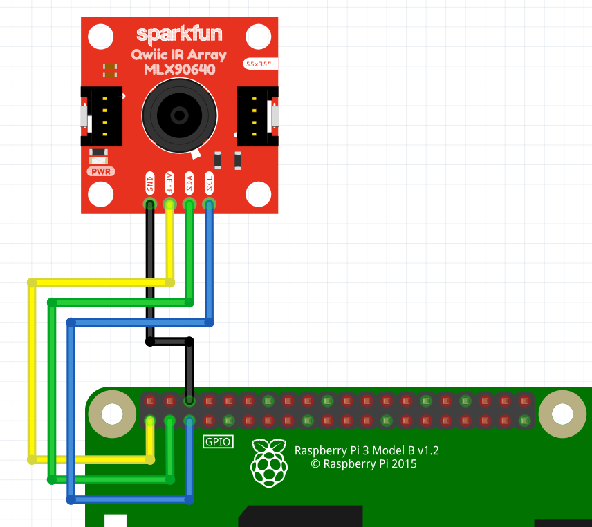

# 7/7/19
Commands:
~~~console
$ cd VKCDemos
$ git submodule update --init --recursive
$ cd scripts
$ sudo ./rpi_cam_install.sh
$ sudo reboot now
$ cd scripts
$ sudo ./mlx90640_install.sh
$ sudo reboot now
$ raspistill -o cam.jpg # camera works as expected # rpi_cam.py: changed "import queue" to "from multiprocessing import Queue"
$ cd periphreals
$ python ./rpi_cam.py # live video feed highlighting one or more small circles with pirple ring and gray center mark
$ python3 ./rpi_cam.py
import cv2, ImportError: numpy.core.multiarray failed to import
$ sudo i2cdetect -y 1
finds 0x33
$ sudo ./mlx90640.sh # only reports error
 Traceback (most recent call last):
   File "mlx90640.py", line 40, in <module>
     main(sys.argv[1:])
   File "mlx90640.py", line 29, in main
     img[h][w] = temp_to_col(val)
   File "mlx90640.py", line 10, in temp_to_col
     return [int(c*255) for c in colorsys.hsv_to_rgb(hue % 1, 1.0, 1.0)]
   File "/usr/lib/python3.5/colorsys.py", line 146, in hsv_to_rgb
     i = int(h*6.0) # XXX assume int() truncates!
 ValueError: cannot convert float NaN to integer
$ sudo i2cdetect -y 1 
only finds 0x03
$ sudo i2cdetect -y 1 
finds no devices on second call
--- 7/9/19 ---
$ ~/vkc-demo/bin/activate
bash: /home/pi/vkc-demo/bin/activate: Permission denied
-- right-click /home/pi/vkc-demo/bin/activate
-- set run premission to "only owner"
$ ~/vkc-demo/bin/activate
-- no error
$ cd /home/pi/Documents/VKCDemos/src/drivers/peripherals/
$ sudo ./mlx90640.sh
Retries: 9 
Got data for page 1
Converting data for page 1
Retries: 8 
Got data for page 0
Converting data for page 0
Finishing
Traceback (most recent call last):
  File "mlx90640.py", line 40, in <module>
    main(sys.argv[1:])
  File "mlx90640.py", line 29, in main
    img[h][w] = temp_to_col(val)
  File "mlx90640.py", line 10, in temp_to_col
    return [int(c*255) for c in colorsys.hsv_to_rgb(hue % 1, 1.0, 1.0)]
  File "/usr/lib/python3.5/colorsys.py", line 146, in hsv_to_rgb
    i = int(h*6.0) # XXX assume int() truncates!
ValueError: cannot convert float NaN to integer
$ sudo i2cdetect -y 1 
$ sudo i2cdetect -y 1 
     0  1  2  3  4  5  6  7  8  9  a  b  c  d  e  f
00:          03 -- -- -- -- -- -- -- -- -- -- -- -- 
10: -- -- -- -- -- -- -- -- -- -- -- -- -- -- -- -- 
20: -- -- -- -- -- -- -- -- -- -- -- -- -- -- -- -- 
30: -- -- -- -- -- -- -- -- -- -- -- -- -- -- -- -- 
40: -- -- -- -- -- -- -- -- -- -- -- -- -- -- -- -- 
50: -- -- -- -- -- -- -- -- -- -- -- -- -- -- -- -- 
60: -- -- -- -- -- -- -- -- -- -- -- -- -- -- -- -- 
70: -- -- -- -- -- -- -- --                         
$ sudo i2cdetect -y 1 
     0  1  2  3  4  5  6  7  8  9  a  b  c  d  e  f
00:          -- -- -- -- -- -- -- -- -- -- -- -- -- 
10: -- -- -- -- -- -- -- -- -- -- -- -- -- -- -- -- 
20: -- -- -- -- -- -- -- -- -- -- -- -- -- -- -- -- 
30: -- -- -- -- -- -- -- -- -- -- -- -- -- -- -- -- 
40: -- -- -- -- -- -- -- -- -- -- -- -- -- -- -- -- 
50: -- -- -- -- -- -- -- -- -- -- -- -- -- -- -- -- 
60: -- -- -- -- -- -- -- -- -- -- -- -- -- -- -- -- 
70: -- -- -- -- -- -- -- --                       
$ cd /home/pi/Documents/ir_cam1/RPiMLX90640
-- swap to c-code test script
$ sudo ./MLX90640 10 > temp2.txt
-- successful read back: /docs/ir_test_hand.png
$ sudo i2cdetect -y 1 
     0  1  2  3  4  5  6  7  8  9  a  b  c  d  e  f
00:          03 -- -- -- -- -- -- -- -- -- -- -- -- 
10: -- -- -- -- -- -- -- -- -- -- -- -- -- -- -- -- 
20: -- -- -- -- -- -- -- -- -- -- -- -- -- -- -- -- 
30: -- -- -- -- -- -- -- -- -- -- -- -- -- -- -- -- 
40: -- -- -- -- -- -- -- -- -- -- -- -- -- -- -- -- 
50: -- -- -- -- -- -- -- -- -- -- -- -- -- -- -- -- 
60: -- -- -- -- -- -- -- -- -- -- -- -- -- -- -- -- 
70: -- -- -- -- -- -- -- --                   
$ sudo i2cdetect -y 1 
     0  1  2  3  4  5  6  7  8  9  a  b  c  d  e  f
00:          -- -- -- -- -- -- -- -- -- -- -- -- -- 
10: -- -- -- -- -- -- -- -- -- -- -- -- -- -- -- -- 
20: -- -- -- -- -- -- -- -- -- -- -- -- -- -- -- -- 
30: -- -- -- -- -- -- -- -- -- -- -- -- -- -- -- -- 
40: -- -- -- -- -- -- -- -- -- -- -- -- -- -- -- -- 
50: -- -- -- -- -- -- -- -- -- -- -- -- -- -- -- -- 
60: -- -- -- -- -- -- -- -- -- -- -- -- -- -- -- -- 
70: -- -- -- -- -- -- -- --                       

~~~
however, running a non-python library indicates sensor is alive: https://github.com/abood91/RPiMLX90640

# Software
Software is installed on the Raspberry Pi. Fetch the image and install according from [raspberrypi.org][rpi-rasp-dl]. This demo is using the "Raspbian Stretch with desktop" Image. Once installed, login to the Raspberry Pi and then fetch the source

~~~console
$ mkdir src
$ cd src
$ git clone https://github.com/scottalmond/VKCDemos.git
$ cd VKCDemos
$ git submodule update --init --recursive
~~~

# VKCDemos

## Raspberry Pi Camera
This is a brief overview of [using][rpi-cam-proj] the [Raspberry Pi Camera][rpi-cam-link]. 

### Usage
The example included script detects circles. 

~~~console
$ ~/vkc-demo/bin/activate
$ cd src/drivers/peripherals/
$ python ./rpi_cam.py
~~~

### Hook-up
Connect the ribbon cable

#### Configure the Raspberry Pi Camera

There is a install script that should (currently)

 * Install the dependancies
 * Setup the camera
 * Setup a [python virtual environment][py-venv] in `~/vkc-demo`
    - Installs OpenCV for python

Run the install script by:
~~~console
$ cd scripts
$ sudo ./rpi_cam_install.sh
~~~
Finally, reboot.

## MLX90640
This is an overview of installing and using the [MLX90640][mlx90640-ref]. This example uses [this][mlx90640-lib] Library.

### Usage

~~~console
$ cd src/drivers/peripherals/
$ sudo ./mlx90640.sh
~~~

### Hook-up

#### Wires for I2C 
[][mlx90640-hookup]

#### Install MLX90640 Software

There is a install script that should (currently)

 * Install the dependancies
 * Setup I2C
 * Build the library and install the python library
 * Setup a [python virtual environment][py-venv] in `~/vkc-demo`

Run the install script by:
~~~console
$ cd scripts
$ sudo ./mlx90640_install.sh
~~~
Finally, reboot.

### Usage

~~~console
$ cd src/drivers/peripherals/
$ sudo ./mlx906640.sh
~~~

[rpi-rasp-dl]:     https://www.raspberrypi.org/downloads/raspbian/
[rpi-cam-proj]:    https://projects.raspberrypi.org/en/projects/getting-started-with-picamera
[rpi-cam-link]:    https://www.raspberrypi.org/products/pi-noir-camera-v2/
[mlx90640-ref]:    https://www.sparkfun.com/products/14844
[mlx90640-lib]:    https://github.com/pimoroni/mlx90640-library
[mlx90640-hookup]: https://learn.sparkfun.com/tutorials/qwiic-ir-array-mlx90640-hookup-guide/all
[py-venv]:         https://docs.python.org/3/library/venv.html

