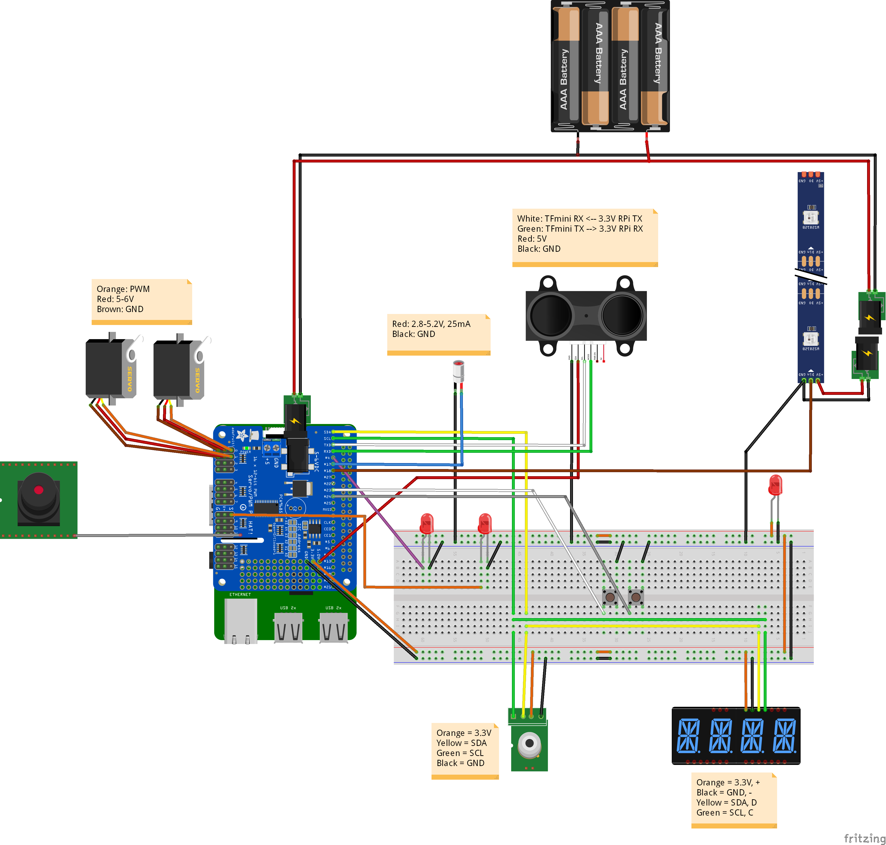

# VKC Demos

The code contained in this project is intended to demonstrate the functionality of each periphreal one-at-a-time.
A demo box has been constructed to show one way these devices can be connected.
The code below shows how the devices can be installed using NOOBS 3.2.0 and Python 3.7.3 on a Raspberry Pi 3B+.

## Hardware setup

## Software

https://github.com/scottalmond/VKCDemos/blob/master/docs/install_log.txt